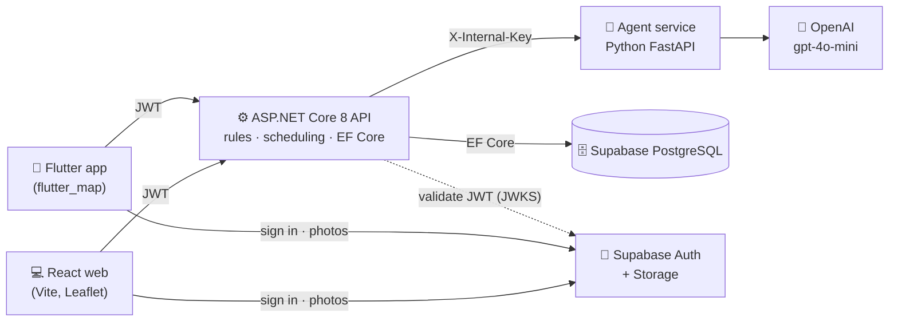

<div align="center">

<picture>
  <source media="(prefers-color-scheme: dark)" srcset="frontend/public/brand/ecocycle-logo-light.svg">
  
</picture>

# EcoCycle

**AI-assisted waste-pickup platform for residents, collectors and council admins.**

     

[](https://github.com/DevDilshan/EcoCycle-Webapp/actions/workflows/backend-ci.yml)

[✨ Features](#-features) · [🏗️ Architecture](#-architecture) · [🚀 Running locally](#-running-locally) · [🌐 API](#-api) · [🧪 Testing](#-testing) · [🚢 Deploying](#-deploying)

[💻 Web app](frontend/README.md) · [📱 Mobile app](mobile/README.md)

</div>

Residents book a pickup with a photo. A pipeline of four AI agents classifies the waste, checks it against business rules and picks a collector and day. Anything risky pauses for an admin to approve. Collectors work their round on web or mobile, and residents earn reward points when their waste is collected.

---

## 📑 Contents

- [Features](#-features)
- [Architecture](#-architecture)
- [How a pickup flows](#-how-a-pickup-flows)
- [Repository layout](#-repository-layout)
- [Running locally](#-running-locally)
- [Configuration](#-configuration)
- [API](#-api)
- [Testing](#-testing)
- [Deploying](#-deploying)
- [Known gaps](#-known-gaps)

---

## ✨ Features

| Feature | Who uses it | What it does |
|---|---|---|
| 📦 **Pickup Requests** | Resident | Book a pickup with a photo, address, contact number and zone. The photo is checked by AI vision. Pickups can be one-off or recurring. |
| 🚛 **Route & Dispatch** | Admin, Collector | Admins set up zones, draw each zone's collection outline, and set collection days and collector capacity. Collectors see today's stops, upcoming stops, overdue stops and a route map, and mark each stop collected or not collected. |
| 🚩 **Complaints & Approvals** | Admin, Resident | Flagged pickups wait in an approval queue showing the AI's reasoning. Residents raise complaints and track their status. |
| 🎁 **Recycling & Rewards** | Resident, Admin | Points are awarded automatically when a stop is completed. Residents redeem catalogue items that are collected in person, emailed or posted. An approved request gets a one-time code, and the admin records the hand-over. |
| 🗺️ **Collection areas** | Everyone | Zone outlines are drawn on the landing page, the admin maps, the collector route map and the pickup pin picker. A pin outside the chosen zone is refused. |

**Clients:** a React web app (resident, collector and admin consoles) and a Flutter mobile app (resident and collector). Both use the same API and the same Supabase login, with email or Google.

---

## 🏗️ Architecture



| Layer | Technology | Role |
|---|---|---|
| Web client | React + Vite, Leaflet / OpenStreetMap | Resident, collector and admin consoles |
| Mobile client | Flutter, `supabase_flutter`, `flutter_map` | Resident and collector app |
| API | ASP.NET Core 8, EF Core, Npgsql | Business rules, scheduling, validation, auth |
| AI agents | Python, FastAPI | Classifier, Validator, Routing and Notifier agents |
| Data | Supabase PostgreSQL | 12 application tables |
| Auth & files | Supabase Auth (email + Google), Supabase Storage | JWTs, pickup photos, reward pictures, area outlines |

---

## 🔄 How a pickup flows

1. **Submit.** The resident uploads a photo and can drop a pin, which must fall inside the chosen zone's outline when it has one. Then and AI vision checks that it's a clear photo of waste. If that check can't run, submission still goes ahead (fail-open). The pickup is then saved as `Pending`.
2. **Prepare.** The API works out the **legal slots**: collectors who can carry this type of waste, have capacity left, and serve that zone on that day, over the next 14 days.
3. **Agent pipeline** (`/run-pipeline`):
   - 🧠 **Classifier** (AI). Puts the waste in one of 6 categories, with a confidence score, using the photo and the description. It falls back to the text alone if photo analysis fails.
   - ✅ **Validator** (rules, no AI). Hazardous waste always needs an admin, and a resident may have at most 2 bulky pickups a month.
   - 🚛 **Routing** (AI). Runs only if no rule was broken. It picks a slot **number** from the legal list, so it can never invent a collector or a date.
   - 📨 **Notifier** (AI). Runs only if the pickup was flagged. It recommends approve, reject or revise to the admin.
4. **Second check in .NET.** `ComplianceRules` re-checks restricted categories, low confidence (below 0.70) and contaminated waste, plus the bulky allowance.
5. **Outcome:**
   - ✅ **Clean.** A route stop is created and the pickup becomes `Scheduled`.
   - ⏸ **Flagged.** An `ApprovalRequest` is created with the full AI result stored as JSON, and the resident sees "In review". When an admin approves it, the pickup is routed then, using current collector loads, without classifying the photo again. The Notifier then writes the resident a plain-language message.
6. **Collection.** The collector marks the stop collected, which closes it, completes the pickup and awards points in one save. Or they mark it not collected with a reason, and the pickup is rebooked.

> ⚠️ If the agent service is unreachable, the pickup stays `Pending` and an admin can assign it by hand. A resident's submission never fails because the AI is down.

---

## 📁 Repository layout

```
frontend/        💻 React + Vite web app (resident, collector, admin)
mobile/          📱 Flutter app (resident, collector)
backend/         ⚙️  ASP.NET Core 8 Web API – shared by web and mobile
backend.Tests/   🧪 xUnit tests (unit, API, database, end-to-end, performance)
agentic-ai/      🤖 Python FastAPI service running the four AI agents
supabase/        🗄️  SQL for storage buckets and signup role rules
scripts/         🔧 Helper scripts (agent check, area outline preparation and upload)
docs/            📚 Notes on collection boundaries
test-data/       🧩 Shared geometry cases checked by .NET, JavaScript and Dart
```

---

## 🚀 Running locally

**Prerequisites:** .NET 8 SDK, Node.js 20+, Python 3.12+, Flutter 3.8+, a Supabase project and an OpenAI API key.

Start the services in this order, each in its own terminal.

### 1. 🤖 Agent service

```bash
cd agentic-ai
python -m venv .venv                 # first time only
.venv\Scripts\activate               # macOS/Linux/Git Bash: source .venv/Scripts/activate
pip install -r requirements.txt
cp .env.example .env                 # first time only, then fill in the keys
uvicorn api:app --reload --port 8000
```

Check it at <http://127.0.0.1:8000/health>. Activate the venv in **every** new terminal, or you'll get `ModuleNotFoundError`.

### 2. ⚙️ Backend

```bash
cd backend
cp .env.example .env                 # first time only
dotnet ef database update            # apply migrations
dotnet run                           # http://localhost:5051 (Swagger at /swagger)
```

### 3. 💻 Web

```bash
cd frontend
npm install
cp .env.example .env
npm run dev                          # http://localhost:5173
```

Vite proxies `/api` to `localhost:5051`, so leave `VITE_API_BASE_URL` empty when running locally.

### 4. 📱 Mobile

```bash
cd mobile
cp .env.example .env
flutter pub get
flutter run
```

Set `API_BASE_URL` in `mobile/.env` to match your device:

| Device | `API_BASE_URL` |
|---|---|
| Android emulator | `http://10.0.2.2:5051/api` |
| iOS simulator / Flutter web | `http://localhost:5051/api` |
| Release | your deployed API URL + `/api` |

> 💡 On Windows, if the Android build fails with *"different roots"*, your project and the Flutter package cache are on different drives. `mobile/android/gradle.properties` already disables Kotlin incremental builds to avoid this.

---

## 🔑 Configuration

Each app reads its own **gitignored** `.env`. Copy the `.env.example` next to it, and 🚫 never commit a real key.

<details>
<summary><b><code>backend/.env</code></b></summary>

| Variable | Purpose |
|---|---|
| `SUPABASE_CONNECTION_STRING` | PostgreSQL connection string (session pooler) |
| `SUPABASE_URL` | Supabase project URL, used as the JWT issuer and for JWKS |
| `SUPABASE_JWT_SECRET` | Legacy JWT secret, required at startup |
| `SUPABASE_SERVICE_ROLE_KEY` | Server-side admin key, used for account deletion and reward picture upload |
| `AGENT_SERVICE_URL` | Agent service URL (default `http://localhost:8000`) |
| `INTERNAL_API_KEY` | Shared secret sent to the agent service |
| `CORS_ALLOWED_ORIGINS` | Comma-separated web origins (default `http://localhost:5173`) |

</details>

<details>
<summary><b><code>agentic-ai/.env</code></b></summary>

| Variable | Purpose |
|---|---|
| `OPENAI_API_KEY` | Required. Agent reasoning and photo recognition. |
| `INTERNAL_API_KEY` | ⚠️ **Must match the backend's value**, or every call is rejected with 401 |
| `OPENAI_VISION_MODEL` | Optional vision model (default `gpt-4o-mini`) |

</details>

<details>
<summary><b><code>frontend/.env</code></b></summary>

| Variable | Purpose |
|---|---|
| `VITE_SUPABASE_URL` | Supabase project URL |
| `VITE_SUPABASE_ANON_KEY` | Supabase public key (never the secret key) |
| `VITE_SUPABASE_PICKUP_BUCKET` | Storage bucket for pickup photos |
| `VITE_API_BASE_URL` | Backend origin. Leave empty locally. |
| `VITE_BOUNDARY_DATA_URL` | Optional. Where the Sri Lanka area outlines are served from. Defaults to the project's `boundary-data` bucket. |

</details>

<details>
<summary><b><code>mobile/.env</code></b></summary>

| Variable | Purpose |
|---|---|
| `SUPABASE_URL` | Supabase project URL |
| `SUPABASE_ANON_KEY` | Supabase public key |
| `SUPABASE_PICKUP_BUCKET` | Storage bucket for pickup photos |
| `API_BASE_URL` | Backend API URL including `/api` |

</details>

---

## 🌐 API

Every endpoint is under `/api` and needs a Supabase JWT, sent as `Authorization: Bearer <token>`. The roles are `admin`, `collector` and `resident`. A legacy role of `user` is treated as `resident`. Swagger UI is served at `/swagger` in Development.

| Area | Key endpoints |
|---|---|
| 📦 Pickups | `POST /pickuprequests`, `POST /pickuprequests/validate-photo`, `POST /pickuprequests/{id}/run-agent-pipeline`, `GET /pickuprequests`, `PUT`/`DELETE /pickuprequests/{id}` |
| 🚩 Approvals (admin) | `GET /approvals`, `POST /approvals/{id}/approve`, `/reject`, `/request-revision` |
| 🚛 Routes | `GET /routes/{collectorId}/today`, `/upcoming`, `PATCH /routes/{id}/complete`, `/missed`, `GET /routes/day`, `/overdue`, `/load-report`, `/zone-load`, `POST /routes/assign/{pickupId}`, `PUT /routes/{id}/reassign` |
| 🗺️ Zones | `GET /zones`, `/zones/selectable`, `/zones/public`, `POST`, `PUT`, `DELETE /zones/{id}` (retire), `DELETE /zones/{id}/permanent` (a retired zone nothing was booked in) |
| 💬 Complaints | `POST /complaints`, `GET /complaints`, `PUT`/`DELETE /complaints/{id}` |
| 🎁 Rewards | `GET /rewards/leaderboard`, `GET /rewards/{residentId}/history`, admin corrections |
| 🛍️ Catalogue | `GET /reward-items`, admin `POST`/`PUT`/`DELETE`, admin `POST /reward-items/image` (picture upload) |
| 🎟️ Redemptions | `POST /redemptions`, `GET /redemptions`, admin `POST /redemptions/{id}/approve` / `/reject` / `/fulfil` (collected, emailed or posted) |
| 👤 Profiles | `GET /profiles?role=resident\|collector\|admin` |

**Pickup statuses:** `Pending` → `Classified` → (`Approved`) → `Scheduled` → `Completed`, or `Rejected`.

**Status updates are pulled, not pushed.** The web app checks again every 5 seconds while a pickup is being classified, and mobile uses pull-to-refresh.

---

## 🧪 Testing

| Suite | Command | Notes |
|---|---|---|
| Backend (xUnit) | `dotnet test backend.Tests` | 321 tests. The 17 PostgreSQL integration tests are skipped without a live database. |
| Web (Vitest) | `cd frontend && npm test` | Pickups, auth guard, API client, map helpers, zone outlines, reward slip |
| Mobile | `cd mobile && flutter test` | Form validation, layout, maps, auth screens, zone outlines, reward catalogue |
| Agents | `cd agentic-ai && python -m pytest` | Classifier evaluation and vision checks. Some scripts need a live OpenAI key. |
| Lint | `cd frontend && npm run lint` · `cd mobile && flutter analyze` | |

**CI:** GitHub Actions restores, builds and tests the backend on every push and pull request to `main` and `dev`. See [`.github/workflows/backend-ci.yml`](.github/workflows/backend-ci.yml).

---

## 🚢 Deploying

| Service | Host | Notes |
|---|---|---|
| Web | Vercel | `frontend/vercel.json` rewrites all routes to `index.html`. Set `VITE_API_BASE_URL` to the deployed API. |
| API | Render (Docker) | [`backend/Dockerfile`](backend/Dockerfile), `Root Directory = backend`. Binds `0.0.0.0:$PORT`. |
| Agents | Render (Docker) | [`agentic-ai/Dockerfile`](agentic-ai/Dockerfile), `Root Directory = agentic-ai`. Runs `uvicorn api:app --host 0.0.0.0 --port $PORT`. |
| Database, auth and storage | Supabase | Run the SQL in [`supabase/`](supabase/) for the photo bucket and signup role rules. Reward pictures use the `reward-images` bucket and area outlines the `boundary-data` bucket (`python scripts/upload_boundaries.py`). |

Set every Configuration variable in the host's environment. Both services read real environment variables when no `.env` file is present.

> ⏳ On Render's free tier, services sleep after inactivity, so the first request can take about 50 seconds. Use `/health` to wake the agent service.

---

## ⚠️ Known gaps

- **Map pins are approximate** unless the resident pins an exact spot. Street addresses aren't geocoded.
- **Zone outlines are administrative divisions**, used as a starting point. They are not verified council collection areas.
- **Emailed rewards are sent by hand.** The app records that an admin emailed the reward; it does not send the email.
- **Status updates are pulled.** There are no push notifications or realtime updates yet.
- **Zone locations are looked up** through OpenStreetMap Nominatim from the admin's browser. At higher volume this should move server-side with caching.
- **`RewardRules` (C#) duplicates the Python Validator's bulky-limit rule.** Remove it once nothing depends on `POST /rewards/validate/{pickupRequestId}`.
